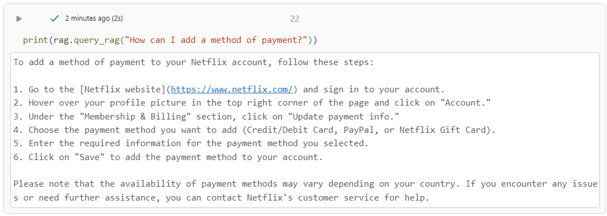
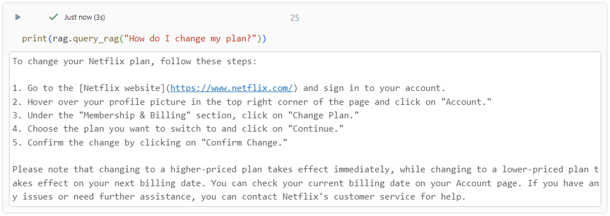

# Databricks-Gen-AI-2024
Netflix chatbot to answer customer support questions!
* Scraped help page data through Netflix's sitemap  
* Used Databricks vector search, Retrieval Augmented Generation (RAG), and chat management to create the chatbot 
* Used LlamaIndex to parse through HTML and stored data in Databricks Delta Lake tables 

Built for the 2024 Databricks Generative AI World Cup hackathon following the [LLM RAG chatbot demo](https://notebooks.databricks.com/demos/llm-rag-chatbot/index.html#) and [tutorial](https://databricks.zoom.us/rec/play/veUejXP3D-a3gzRdXhVCkLJ_vzRwCplkI1X_1uGwt5kYMWujSEgg8gFLMwuT2ViLaanJs_E_NxVrx3rr.md4jvVf8qNHGgciP?hasValidToken=false&canPlayFromShare=true&from=share_recording_detail&continueMode=true&componentName=rec-play&originRequestUrl=https%3A%2F%2Fdatabricks.zoom.us%2Frec%2Fshare%2F4UiGZ9sRYDiWj8SWjPIpfh1NABficyUYoPCNUmW6rmIbBw35QwdvlOv_0igImf8l.rWZZIbSGRAHdRz6g).

 

### Challenges
* I had trouble applying the demo code to chunk HTML code into divs because of Netflix's help page formatting, so I used LlamaIndex instead 

### Happy with
* Scraping help page URLs off the Netflix sitemap instead of hardcoding them
* Building my first chatbot! 

